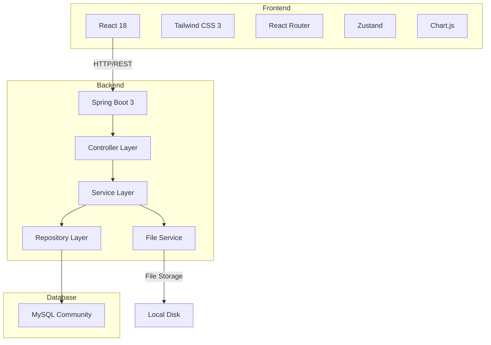
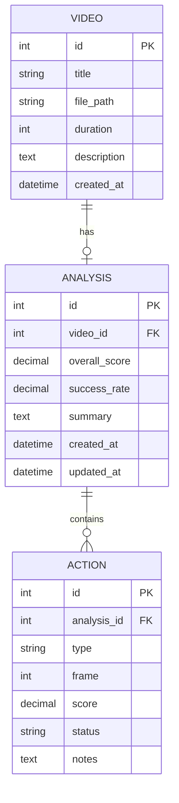

## 1. Architecture Design



## 2. Technology Description
- **Frontend**: React@18 + tailwindcss@3 + vite + TypeScript
- **Backend**: Spring Boot 3 (Java 17+) + MySQL Connector
- **Database**: MySQL Community Edition (免费版)
- **File Storage**: 本地文件系统
- **Build Tool**: Maven (Backend) + npm/pnpm (Frontend)

## 3. Route Definitions

### Frontend Routes
| Route | Purpose |
|-------|---------|
| / | 首页 - 快速上传和历史记录 |
| /analysis/:id | 视频分析页面 |
| /dashboard | 数据分析和报告页面 |
| /history | 历史记录列表 |

### Backend API Endpoints
| Method | Endpoint | Purpose |
|--------|----------|---------|
| POST | /api/videos/upload | 上传视频文件 |
| GET | /api/videos | 获取视频列表 |
| GET | /api/videos/:id | 获取视频详情 |
| DELETE | /api/videos/:id | 删除视频 |
| POST | /api/analyses | 创建分析记录 |
| GET | /api/analyses | 获取分析列表 |
| GET | /api/analyses/:id | 获取分析详情 |
| PUT | /api/analyses/:id | 更新分析 |
| GET | /api/analyses/stats | 获取统计数据 |
| GET | /api/reports/export/:id | 导出分析报告 |

## 4. API Definitions

### Request/Response Schemas

#### Video Upload
```typescript
// Request: multipart/form-data
interface VideoUploadRequest {
  file: File;
  title: string;
  description?: string;
}

// Response
interface VideoResponse {
  id: number;
  title: string;
  filePath: string;
  duration: number;
  createdAt: string;
}
```

#### Analysis
```typescript
interface Action {
  id: number;
  type: 'serve' | 'forehand' | 'backhand' | 'smash' | 'drop' | 'net';
  frame: number;
  score: number;
  status: 'success' | 'fail' | 'improve';
  notes: string;
}

interface AnalysisRequest {
  videoId: number;
  actions: Action[];
  overallScore: number;
  summary: string;
}

interface AnalysisResponse {
  id: number;
  videoId: number;
  overallScore: number;
  successRate: number;
  actions: Action[];
  summary: string;
  createdAt: string;
}
```

#### Statistics
```typescript
interface StatsResponse {
  totalVideos: number;
  totalAnalyses: number;
  averageScore: number;
  actionStats: {
    type: string;
    count: number;
    successRate: number;
  }[];
  trendData: {
    date: string;
    score: number;
  }[];
}
```

## 5. Database Design

### 5.1 ER Diagram



### 5.2 DDL Statements

```sql
CREATE DATABASE IF NOT EXISTS badminton_analysis;

USE badminton_analysis;

CREATE TABLE video (
    id INT AUTO_INCREMENT PRIMARY KEY,
    title VARCHAR(255) NOT NULL,
    file_path VARCHAR(500) NOT NULL,
    duration INT DEFAULT 0,
    description TEXT,
    created_at TIMESTAMP DEFAULT CURRENT_TIMESTAMP,
    INDEX idx_created_at (created_at)
) ENGINE=InnoDB DEFAULT CHARSET=utf8mb4;

CREATE TABLE analysis (
    id INT AUTO_INCREMENT PRIMARY KEY,
    video_id INT NOT NULL,
    overall_score DECIMAL(5,2) DEFAULT 0,
    success_rate DECIMAL(5,2) DEFAULT 0,
    summary TEXT,
    created_at TIMESTAMP DEFAULT CURRENT_TIMESTAMP,
    updated_at TIMESTAMP DEFAULT CURRENT_TIMESTAMP ON UPDATE CURRENT_TIMESTAMP,
    FOREIGN KEY (video_id) REFERENCES video(id) ON DELETE CASCADE,
    INDEX idx_video_id (video_id),
    INDEX idx_created_at (created_at)
) ENGINE=InnoDB DEFAULT CHARSET=utf8mb4;

CREATE TABLE action (
    id INT AUTO_INCREMENT PRIMARY KEY,
    analysis_id INT NOT NULL,
    type VARCHAR(50) NOT NULL,
    frame INT DEFAULT 0,
    score DECIMAL(5,2) DEFAULT 0,
    status VARCHAR(20) NOT NULL,
    notes TEXT,
    FOREIGN KEY (analysis_id) REFERENCES analysis(id) ON DELETE CASCADE,
    INDEX idx_analysis_id (analysis_id),
    INDEX idx_type (type)
) ENGINE=InnoDB DEFAULT CHARSET=utf8mb4;
```

## 6. Project Structure

### Frontend (src/)
```
src/
├── components/
├── pages/
├── hooks/
├── utils/
├── stores/
└── App.tsx
```

### Backend (api/)
```
api/
├── src/main/java/
│   └── com/badminton/
│       ├── controller/
│       ├── service/
│       ├── repository/
│       ├── model/
│       └── config/
├── src/main/resources/
│   └── application.yml
└── pom.xml
```

## 7. File Upload Configuration
- 最大文件大小: 500MB
- 支持格式: mp4, avi, mov, mkv
- 存储路径: /uploads/videos/
- 文件命名: UUID + 原始扩展名
