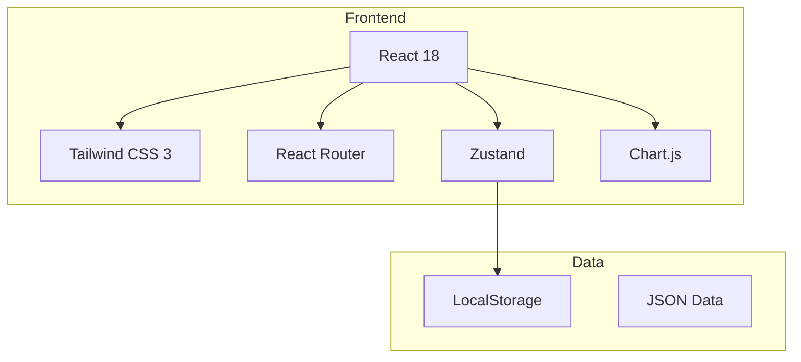
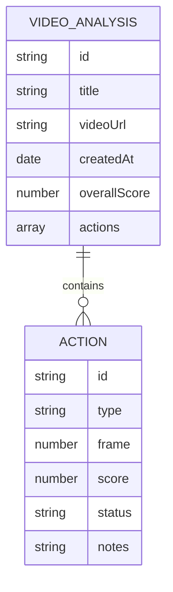

## 1. Architecture Design



## 2. Technology Description
- Frontend: React@18 + tailwindcss@3 + vite + TypeScript
- Initialization Tool: vite-init
- Backend: None (纯前端应用)
- Database: LocalStorage (用于存储分析记录)
- 图表库: Chart.js

## 3. Route Definitions
| Route | Purpose |
|-------|---------|
| / | 首页 - 快速上传和历史记录 |
| /analysis/:id | 视频分析页面 |
| /dashboard | 数据分析和报告页面 |
| /history | 历史记录列表 |

## 4. API Definitions
本项目为纯前端应用，无后端 API

## 5. Server Architecture Diagram
本项目无后端服务

## 6. Data Model

### 6.1 Data Model Definition



### 6.2 Data Definition Language
本项目使用 LocalStorage 存储数据，无 SQL DDL

数据结构示例:
```typescript
interface Action {
  id: string;
  type: 'serve' | 'forehand' | 'backhand' | 'smash' | 'drop' | 'net';
  frame: number;
  score: number;
  status: 'success' | 'fail' | 'improve';
  notes: string;
}

interface VideoAnalysis {
  id: string;
  title: string;
  videoUrl: string;
  createdAt: Date;
  overallScore: number;
  actions: Action[];
}
```
