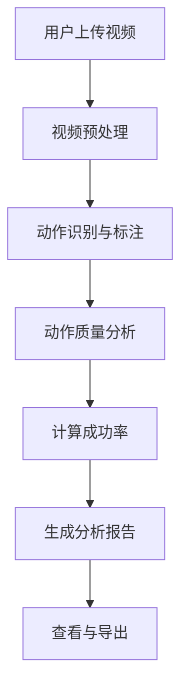

## 1. Product Overview
羽毛球教学视频分析软件，帮助教练和学员分析羽毛球动作，提高训练效率
- 针对羽毛球教学场景，实现动作分析、成功率计算、训练报告生成
- 目标用户：羽毛球教练、学员、训练机构

## 2. Core Features

### 2.1 User Roles
| Role | Registration Method | Core Permissions |
|------|---------------------|------------------|
| 教练 | 邮箱注册 | 上传视频、分析动作、查看历史分析、生成报告 |
| 学员 | 邮箱注册 | 查看个人分析、训练报告 |

### 2.2 Feature Module
1. **首页**: 快速上传、历史记录、功能导航
2. **视频分析页**: 视频预览、动作标注、分析结果
3. **数据分析页**: 成功率统计、动作对比、训练报告
4. **历史记录页**: 历史分析列表、详情查看

### 2.3 Page Details
| Page Name | Module Name | Feature description |
|-----------|-------------|---------------------|
| 首页 | 快速上传 | 拖拽或点击上传羽毛球训练视频 |
| 首页 | 历史记录 | 显示最近分析记录 |
| 视频分析页 | 视频播放器 | 支持播放、暂停、快进、慢放 |
| 视频分析页 | 动作标注 | 手动/自动标注关键动作帧 |
| 视频分析页 | 分析结果 | 显示动作评分、问题点、改进建议 |
| 数据分析页 | 成功率统计 | 饼图、柱状图展示各类动作成功率 |
| 数据分析页 | 训练报告 | 生成可导出的训练分析报告 |

## 3. Core Process
用户上传视频 → 系统进行动作分析 → 教练/学员查看分析结果 → 生成训练报告 → 基于报告进行改进训练

## 4. User Interface Design
### 4.1 Design Style
- 主色调：深蓝色 (#1E40AF) 代表专业
- 辅助色：活力绿 (#10B981) 代表进步
- 按钮风格：圆角矩形，带有阴影效果
- 字体：Poppins 标题 + Inter 正文
- 布局风格：卡片式布局，清晰的区域分隔
- 图标风格：线性图标，简洁现代

### 4.2 Page Design Overview
| Page Name | Module Name | UI Elements |
|-----------|-------------|-------------|
| 首页 | Hero区域 | 渐变背景、简洁标题、CTA按钮 |
| 首页 | 功能卡片 | 图标、标题、简短描述、悬停动画 |
| 视频分析页 | 播放器区域 | 视频控件、进度条、标注按钮 |
| 视频分析页 | 分析面板 | 评分卡、问题列表、建议框 |
| 数据分析页 | 图表区域 | 交互式图表、数据卡片、时间轴 |

### 4.3 Responsiveness
桌面端优先设计，支持平板和移动端自适应，触摸操作优化

### 4.4 3D Scene Guidance
本项目不涉及3D场景
